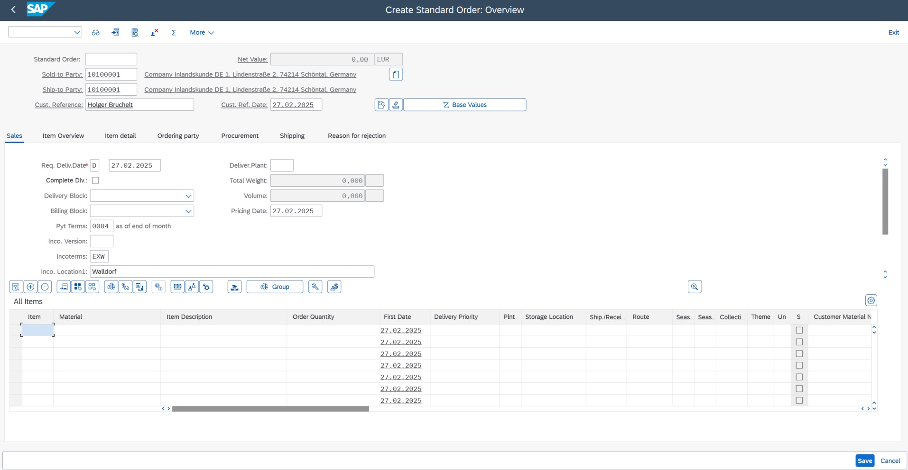
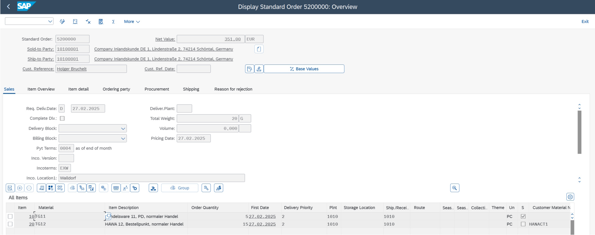

# 🤖 Making SAP Transactions Accessible Using OData APIs for Autonomous Agents and more on Power Platform.

### Why APIs and OData?

APIs provide a **consistent interface** for interacting with complex systems like SAP. With OData APIs, agents can:

- Dynamically construct requests based on user intent  
- Call SAP transactions without needing custom logic  
- Improve accuracy and efficiency over time  

### Importance of OData for General Application Development

**OData (Open Data Protocol)** is crucial for modern application development. Key reasons include:

- **Interoperability**: Seamless integration between SAP and non-SAP applications.
- **Standardization**: Simplifies development and ensures consistency.
- **Flexibility**: Suitable for various application types.

By leveraging SAP OData APIs, developers can create robust, scalable applications that meet modern enterprise needs.


## 🌐 Why APIs Matter for Autonomous Agents and Beyond:

As agents become more autonomous, their ability to interact with enterprise systems through **APIs** has become not just beneficial—but essential. This repository demonstrates how to make **SAP transactions accessible to agents** using a combination of the **Power Platform**, **Copilot Studio**, **Azure AI Foundry**, and **SAP OData APIs**.

In traditional automation setups, **connectors** were used to bridge systems. These connectors often relied on **predefined input fields** that required manual data entry or mappings. While effective for simple workflows, this model breaks down in the context of autonomous agents. Agents are not designed to manually fill out forms or input fields. Instead, they require:

- **Standardized templates** for communication.
- The ability for **dynamic request generation** based on context and reasoning.


## 📦 What's in This Repository

This repo includes everything needed to build and deploy intelligent agents that can interact with SAP:

- **OData API Templates**  
  A curated list of common SAP business object APIs (e.g., Sales Orders, Materials, Vendors) with:
  - Minimum required fields to create each object
  - Example payloads for quick testing and integration

- **Power Automate Flows**  
  Pre-built flows for each trasncation above that:
  - Accept user input
  - Use an HTTP connector to call an  Azure OpenAI API that converts natural language into structured API requests
  - Call SAP using the OData connector
  - Return the response to an agent created on Copilot Studio for further processing


- **Copilot Studio Agent Project**  
  A ready-to-use Copilot Studio project that demonstrates:
  - How to trigger flows using natural language or events
  - How using OData APIs make SAP transactions more easiliy accessible for Agents.
  - How to use new AI features like reasoning and memory
  - How to orchestrate actions across Microsoft 365 and SAP to save time and automate business processes
  - Instructions on how to create it.


## 🚀 Why This Matters

By combining the Power Platform, OpenAI, and SAP OData APIs, this solution enables:

- Seamless integration between communication tools (like Outlook and Teams) and ERP systems  
- Agents that can reason, decide, and act—without manual intervention  
- A scalable foundation for building intelligent business process automation


# SAP APIs from Buisness Accelerator Hub:

| **SAP Object** | **API Documentation** | **Power Automate Flow** |
|----------------|-----------------------|-------------------------|
| Sales Order | [Sales Order](https://github.com/noopurav/ordertocashsteps/tree/main?tab=readme-ov-file#create-sales-order) | Create Sales Order |
| OutBound Delivery | [OutBound Delivery](https://github.com/noopurav/ordertocashsteps/tree/main?tab=readme-ov-file#deliver-the-goods-vl01n) | Create OutBound Delivery |
| Billing Document | [Billing Document](https://github.com/noopurav/ordertocashsteps/tree/main?tab=readme-ov-file#billing-the-sales-order-vf01) | Create Billing Document Flow |
| Releasing Billing to Accounting | [Release Billing Document](https://github.com/noopurav/ordertocashsteps/tree/main#release-billing-document-to-fi-accounting-vf02) | Create Billing Document Flow |
| Purchase Requisition | [Purchase Requistion](https://github.com/noopurav/ordertocashsteps/tree/main?tab=readme-ov-file#purchase-requisition) |  | 
| Purchase Order | [Purchase Order](https://github.com/noopurav/ordertocashsteps/tree/main?tab=readme-ov-file#create-purchase-order) | [Material Document] 
| Goods Receipt |  [Goods Receipt](https://github.com/noopurav/ordertocashsteps/tree/main?tab=readme-ov-file#goods-receipt )   |          |
| Supplier Invoice | [Supplier Invoice]( https://github.com/noopurav/ordertocashsteps/tree/main?tab=readme-ov-file#supplier-invoice) | Create Supplier Invoice Flow |
| Product Master | [Product Master](https://github.com/noopurav/ordertocashsteps/tree/main?tab=readme-ov-file#manage-product-master-data) |       |
| Customer Master |[ Business Partner](https://github.com/noopurav/ordertocashsteps/tree/main?tab=readme-ov-file#manage-customer-master-dat) |       |
| Sales Contract | [Sales Contract](https://github.com/noopurav/ordertocashsteps/tree/main?tab=readme-ov-file#manage-sales-contracts) |
| Customer Return | [CustomerReturn](https://github.com/noopurav/ordertocashsteps/tree/main?tab=readme-ov-file#-manage-customer-returns) |   |
| Credit Memo Request | [Credit Memo Request](https://github.com/noopurav/ordertocashsteps/tree/main?tab=readme-ov-file#manage-credit-memo-requests)  |    |
| Debit Memo Request | [CreateDebit Memo Request](https://github.com/noopurav/ordertocashsteps/tree/main?tab=readme-ov-file#manage-debit-memo-requests) |   |


## Create Sales Order{#create-sales-order}

### OData Service
Information on SAP API Business Hub: [Sales Order (A2X)](https://api.sap.com/api/OP_API_SALES_ORDER_SRV_0001/overview)

* https://{host}:{port}/sap/opu/odata/sap/API_SALES_ORDER_SRV

#### Sample Payload:
```http
# Fetch Sales Order "1! and 
# fetch X-CSRF-Token used for creating a Sales order
# @name FetchReply
GET https://server:port/sap/opu/odata/sap/API_SALES_ORDER_SRV/A_SalesOrder('1')?$format=json
Authorization: Basic {{username}}:{{password}}
X-CSRF-Token: Fetch
```

```http
# Create Sales Order
POST https://server:port/sap/opu/odata/sap/API_SALES_ORDER_SRV/A_SalesOrder
Content-Type: application/json
Authorization: Basic {{username}}:{{password}}
X-CSRF-Token: {{FetchReply.response.headers.x-csrf-token}}

{
    "SalesOrder": "0005200000",
    "SalesOrderType": "OR",
    "SalesOrganization": "1010",
    "DistributionChannel": "10",
    "OrganizationDivision": "00",
    "SoldToParty": "10100001",
    "PurchaseOrderByCustomer": "Holger Bruchelt",
    "to_Item": [
    {
        "SalesOrderItem": "10",
        "SalesOrderItemCategory": "TAN",
        "Material": "TG11",
        "RequestedQuantity": "5"
      },
          {
        "SalesOrderItem": "20",
        "SalesOrderItemCategory": "TAN",
        "Material": "TG12",
        "RequestedQuantity": "15"
      }
    ]
}
```




## Deliver the goods (VL01N)

### OData Service
Information on SAP API Business Hub: [Outbound Delivery (A2X)](https://api.sap.com/api/API_OUTBOUND_DELIVERY_SRV_0002/overview)

* https://{host}:{port}/sap/opu/odata/sap/API_OUTBOUND_DELIVERY_SRV

#### Sample Payload:
```http
# Fetch Sales Order "1! and 
# fetch X-CSRF-Token used for outbound delivery
# @name FetchReply
GET https://server:port/sap/opu/odata/sap/API_OUTBOUND_DELIVERY_SRV/A_OutbDeliveryHeader
Authorization: Basic {{username}}:{{password}}
X-CSRF-Token: Fetch
```

```http
# Create Outbound delivieries with reference to preceding document.
POST https://server:port/sap/opu/odata/sap/API_OUTBOUND_DELIVERY_SRV/A_OutbDeliveryHeader
Content-Type: application/json
Authorization: Basic {{username}}:{{password}}
X-CSRF-Token: {{FetchReply.response.headers.x-csrf-token}}

{


  "to_DeliveryDocumentItem": {
    "results": [
      {
        "ReferenceSDDocument": "0005200000"
      }
    ]
  }
}

```

```http
# Post goods issue for outbound delivery
POST https://server:port/sap/opu/odata/sap/API_OUTBOUND_DELIVERY_SRV/PostGoodsIssue?DeliveryDocument='1'
Content-Type: application/json
Authorization: Basic {{username}}:{{password}}
X-CSRF-Token: {{FetchReply.response.headers.x-csrf-token}}

```
## Billing The Sales Order (VF01)

### OData Service
Information on SAP API Business Hub: [Billing Document (A2X)](https://api.sap.com/api/sap-s4-CE_BILLINGDOCUMENT_0001-v1/overview)

* https://{host}:{port}/sap/opu/odata4/sap/api_billingdocument/srvd_a2x/sap/billingdocument/0001/BillingDocument

#### Sample Payload:
```http
# Fetch Sales Order "1! and 
# fetch X-CSRF-Token used for billing document
# @name FetchReply
GET https://{host}:{port}/sap/opu/odata4/sap/api_billingdocument/srvd_a2x/sap/billingdocument/0001/BillingDocument/BillingDocument
Authorization: Basic {{username}}:{{password}}
X-CSRF-Token: Fetch

```


```http
# Invoke action CreateFromSDDocument
POST https://{host}:{port}/sap/opu/odata4/sap/api_billingdocument/srvd_a2x/sap/billingdocument/0001/BillingDocument/SAP__self.CreateFromSDDocument
Content-Type: application/json
Authorization: Basic {{username}}:{{password}}
X-CSRF-Token: {{FetchReply.response.headers.x-csrf-token}}

{
  "_Control": {
    "DefaultBillingDocumentDate": "2025-03-31",
    "DefaultBillingDocumentType": "F2",
    "AutomPostingToAcctgIsDisabled": false
  },
  "_Reference": [
    {
      "SDDocument": "818279",
      "BillingDocumentType": "F2",
      "BillingDocumentDate": "2025-03-31",
      "DestinationCountry": "DE",
      "SalesOrganization": "1010",
      "SDDocumentCategory": "OR"
    }
  ]
}

```

## Release Billing Document to FI Accounting (VF02)

Information on SAP API Business Hub: [Billing Document (A2X)](https://api.sap.com/api/sap-s4-CE_BILLINGDOCUMENT_0001-v1/overview)

```http

#Invoke action PostToAccounting
POST https://{host}:{port}/sap/opu/odata4/sap/api_billingdocument/srvd_a2x/sap/billingdocument/0001/BillingDocument/:BillingDocument/SAP__self.PostToAccounting
Content-Type: application/json
Authorization: Basic {{username}}:{{password}}
X-CSRF-Token: {{FetchReply.response.headers.x-csrf-token}}
Parameter:  BillingDocument: {{Billing Document Number }}

```

##  Purchase Requisition

### OData Service
Information on SAP API Business Hub: [Purchase Requisition](https://api.sap.com/api/OP_API_PURCHASEREQ_PROCESS_SRV_0001/overview)

* https://{host}:{port}/sap/opu/odata/sap/API_PURCHASEREQ_PROCESS_SRV/A_PurchaseRequisitionHeader
#### Sample Payload:
```http
# Fetch Purchase Requisition "1! and 
# fetch X-CSRF-Token used for Purchase order
# @name FetchReply
GET  https://{host}:{port}/sap/opu/odata/sap/API_PURCHASEREQ_PROCESS_SRV/A_PurchaseRequisitionHeader('10001753')
Authorization: Basic {{username}}:{{password}}
X-CSRF-Token: Fetch

```


```http
# Creates a new Purchase Requisition
POST https://{host}:{port}/sap/opu/odata/sap/API_PURCHASEREQ_PROCESS_SRV/A_PurchaseRequisitionHeader
Content-Type: application/json
Authorization: Basic {{username}}:{{password}}
X-CSRF-Token: {{FetchReply.response.headers.x-csrf-token}}

{
 
  "PurchaseRequisitionType": "NB",
 
  "to_PurchaseReqnItem": {
    "results":[
    {
      "PurchaseRequisition": "",
      "PurchaseRequisitionItem": "1",
      "PurchaseRequisitionItemText": "Test",
      "Material": "MZ-TG-30",
      "Plant": "1710",
      "StorageLocation": "",
      "MaterialGroup": "",
      "PurchasingInfoRecord": "",
      "SupplierMaterialNumber": "",
      "RequestedQuantity": "10",
      "BaseUnit": "PC"
    }
  ]
                                }
}


```

## Create Purchase Order
### OData Service
Information on SAP API Business Hub: [Purchase Order](https://api.sap.com/api/API_PURCHASEORDER_PROCESS_SRV/overview)

* https://{host}:{port}/sap/opu/odata/sap/API_PURCHASEORDER_PROCESS_SRV/A_PurchaseOrder

#### Sample Payload:
```http
# Fetch Purchase Order "1! and 
# fetch X-CSRF-Token used for Purchase order
# @name FetchReply
GET  https://{host}:{port}/sap/opu/odata/sap/API_PURCHASEORDER_PROCESS_SRV/A_PurchaseOrder('4500003601')
Authorization: Basic {{username}}:{{password}}
X-CSRF-Token: Fetch

```


```http
# Creates a new Purchase Order
POST https://{host}:{port}/sap/opu/odata/sap/API_PURCHASEORDER_PROCESS_SRV/A_PurchaseOrder
Content-Type: application/json
Authorization: Basic {{username}}:{{password}}
X-CSRF-Token: {{FetchReply.response.headers.x-csrf-token}}

{
  "CompanyCode": "1010",
  "PurchasingOrganization": "1010",
  "PurchasingGroup": "001",
  "Supplier": "10300001",
  "PurchaseOrderType": "NB",
  "Language": "EN",
  "PaymentTerms": "",
  "DocumentCurrency": "USD",
  "to_PurchaseOrderItem": {
    "results": [
      {
        "PurchaseOrder": "",
        "PurchaseOrderItem": "1",
        "PurchaseOrderItemText": "Test",
        "Material": "TG12",
        "Plant": "1010",
        "StorageLocation": "",
        "MaterialGroup": "",
        "PurchasingInfoRecord": "",
        "SupplierMaterialNumber": "",
        "OrderQuantity": "10",
        "PurchaseOrderQuantityUnit": "PC"
      }
    ]
  }
}

```

## Goods Receipt

Information on SAP API Business Hub: [Material Document](https://api.sap.com/api/API_MATERIAL_DOCUMENT_SRV/overview)

* https://{host}:{port}/sap/opu/odata/sap/API_MATERIAL_DOCUMENT_SRV/A_MaterialDocumentHeader
#### Sample Payload:
```http
# Fetch Purchase Requisition "1! and 
# fetch X-CSRF-Token used for Purchase order
# @name FetchReply
GET  https://{host}:{port}/sap/opu/odata/sap/API_MATERIAL_DOCUMENT_SRV/A_MaterialDocumentHeader('10000564')
Authorization: Basic {{username}}:{{password}}
X-CSRF-Token: Fetch

```


```http
# Creates a material document
POST https://{host}:{port}/sap/opu/odata/sap/API_MATERIAL_DOCUMENT_SRV/A_MaterialDocumentHeader
Content-Type: application/json
Authorization: Basic {{username}}:{{password}}
X-CSRF-Token: {{FetchReply.response.headers.x-csrf-token}}

{
  "MaterialDocument": "",
  "MaterialDocumentHeaderText": "Test Creation of GR",
  "GoodsMovementCode": "01",
  "PostingDate": "/Date(1715731200000)/",
  "GoodsMovementCode": "01",
  "to_MaterialDocumentItem": {
    "results": [
      {
        "Material": "TG12",
        "Plant": "1010",
        "PurchaseOrder": "4500001234",
        "PurchaseOrderItem": "10",
        "QuantityInEntryUnit": "10",
        "GoodsMovementType": "101",
        "GoodsMovementRefDocType": "P",
        "GoodsRecipientName": "John Doe"
      }
    ]
  }
}

```

## Supplier Invoice

Information on SAP API Business Hub: [Supplier Invoice ](https://api.sap.com/api/OP_API_SUPPLIERINVOICE_PROCESS_SRV/overview)

* https://{host}:{port}/sap/opu/odata/sap/API_SUPPLIERINVOICE_PROCESS_SRV/A_SupplierInvoice
#### Sample Payload:
```http
# Fetch Supplier Invoice "1! and 
# fetch X-CSRF-Token used for Purchase order
# @name FetchReply
GET  https://{host}:{port}/sap/opu/odata/sap/API_SUPPLIERINVOICE_PROCESS_SRV/A_SupplierInvoice('565000564')
Authorization: Basic {{username}}:{{password}}
X-CSRF-Token: Fetch

```


```http
# Creates a supplier invoive
POST https://{host}:{port}/sap/opu/odata/sap/API_SUPPLIERINVOICE_PROCESS_SRV/A_SupplierInvoice
Content-Type: application/json
Authorization: Basic {{username}}:{{password}}
X-CSRF-Token: {{FetchReply.response.headers.x-csrf-token}}

{
  "CompanyCode": "1710",
  "DocumentDate": "/Date(1745712000000)/",
  "PostingDate": "/Date(1745712000000)/",
  "InvoicingParty": "USSU9026",
  "DocumentCurrency": "USD",
  "InvoiceGrossAmount": "1000.00",
  "AccountingDocumentType": "KR",
  "to_SuplrInvcItemPurOrdRef": {
    "results": [
      {
        "SupplierInvoiceItem": "0001",
        "PurchaseOrder": "4500001234",
        "PurchaseOrderItem": "00010",
        "DocumentCurrency": "USD",
        "SupplierInvoiceItemAmount": "1000.00",
        "QuantityInPurchaseOrderUnit": "10",
        "PurchaseOrderQuantityUnit": "PC"
       
      }
    ]
  }
}
```


## Manage Product Master Data

### OData Service
Information on SAP API Business Hub: [Product Master](https://api.sap.com/api/API_PRODUCT_SRV/overview)

* https://{host}:{port}/sap/opu/odata/sap/API_PRODUCT_SRV/A_Product
#### Sample Payload:
```http
# Fetch Product "1! and 
# fetch X-CSRF-Token used for Product Master Record
# @name FetchReply
GET  https://{host}:{port}/sap/opu/odata/sap/API_PRODUCT_SRV/A_Product('TEST123BIKE')
Authorization: Basic {{username}}:{{password}}
X-CSRF-Token: Fetch

```


```http
# Creates Product Master Record
POST https://{host}:{port}/sap/opu/odata/sap/API_PRODUCT_SRV/A_Product
Content-Type: application/json
Authorization: Basic {{username}}:{{password}}
X-CSRF-Token: {{FetchReply.response.headers.x-csrf-token}}

{
  "Product": "TEST123BIKE",
  "ProductType": "KMAT",
  "BaseUnit": "EA",
  "CountryOfOrigin": "",
  "ProductGroup": "0002",
  "Division": "",
  "ProductHierarchy": "",
  "CompetitorID": "",
  "Brand": "",
  "IndustrySector": "M",
  "to_Description": {
    "results": [
      {
        "Product": "TEST123BIKE",
        "Language": "EN",
        "ProductDescription": "block material"
      }
    ]
  }
}

```

## Manage Customer Master Data

### OData Service
Information on SAP API Business Hub: [Buisness Partner](https://api.sap.com/api/API_BUSINESS_PARTNER/overview)

* https://{host}:{port}/sap/opu/odata/sap/API_BUSINESS_PARTNER/A_BusinessPartner
#### Sample Payload:
```http
# Fetch Buisness Partner "1! and 
# fetch X-CSRF-Token used for Product Master Record
# @name FetchReply
GET  https://{host}:{port}/sap/opu/odata/sap/API_BUSINESS_PARTNER/A_BusinessPartner?$filter=BusinessPartnerCategory eq '2'
Authorization: Basic {{username}}:{{password}}
X-CSRF-Token: Fetch

```


```http
# Creates a new buisness partner Record
POST https://{host}:{port}/sap/opu/odata/sap/API_BUSINESS_PARTNER/A_BusinessPartner
Content-Type: application/json
Authorization: Basic {{username}}:{{password}}
X-CSRF-Token: {{FetchReply.response.headers.x-csrf-token}}

{
  "BusinessPartnerCategory": "2", // 1 for Person, 2 for Organization, 3 for Group
  "BusinessPartnerFullName": "Roadkings Sports Inc.",
  "OrganizationBPName1": "Roadkings Sports Inc.",
  "FirstName": "John",
  "LastName": "Doe",
  "to_BusinessPartnerAddress": {
    "results": [
      {
        "BusinessPartner": "John Doe",
        "AddressID": "1",
        "StreetName": "123 Main St",
        "CityName": "Redmond",
        "PostalCode": "98052",
        "Country": "US"
      }
    ]
  },
  "to_BusinessPartnerRole": {
    "results": [
      {
        "BusinessPartner": "John Doe",
        "BusinessPartnerRole": "FLCU00",
        "AuthorizationGroup": ""
      }
    ]
  }
}

```
## Manage Sales Contracts

### OData Service
Information on SAP API Business Hub: [Sales Contract](https://api.sap.com/api/OP_API_SALES_CONTRACT_SRV_0001/overview)

* https://{host}:{port}/sap/opu/odata/sap/API_SALES_CONTRACT_SRV/A_SalesContract
#### Sample Payload:
```http
# Fetch Sales Contract "1! and 
# fetch X-CSRF-Token used for Product Master Record
# @name FetchReply
GET   https://{host}:{port}/sap/opu/odata/sap/API_SALES_CONTRACT_SRV/A_SalesContract
Authorization: Basic {{username}}:{{password}}
X-CSRF-Token: Fetch

```


```http
# Creates a new sales contract
POST https://{host}:{port}/sap/opu/odata/sap/API_SALES_CONTRACT_SRV/A_SalesContract
Content-Type: application/json
Authorization: Basic {{username}}:{{password}}
X-CSRF-Token: {{FetchReply.response.headers.x-csrf-token}}

{
  "SalesContract": "",
  "SalesContractType": "ECO2",
  "SalesOrganization": "L100",
  "DistributionChannel": "L0",
  "OrganizationDivision": "L0",
  "SalesGroup": "",
  "SalesOffice": "",
  "SalesDistrict": "",
  "SoldToParty": "1000050",
  "CreatedByUser": "C5250143",
  "PurchaseOrderByCustomer": "",
  "CustomerPurchaseOrderType": "",
  "CustomerPurchaseOrderDate": null,
  "SalesContractDate": "/Date(1746831739204)/",
  "TotalNetAmount": "312800.00",
  "TransactionCurrency": "USD",
  "SDDocumentReason": "",
  "PricingDate": "/Date(1746831739204)/",
  "IncotermsClassification": "CIF",
  "IncotermsTransferLocation": "COST",
  "IncotermsLocation1": "COST",
  "IncotermsLocation2": "",
  "CustomerPaymentTerms": "0001",
  "PaymentMethod": "",
  "SalesContractValidityStartDate": "/Date(1746831739204)/",
  "SalesContractValidityEndDate": "/Date(1746831739204)/",
  "SalesContractValidityPerdUnit": "4",
  "SalesContractValidityPerdCat": "02",
  "SalesContractSignedDate": null,
  "NmbrOfSalesContractValdtyPerd": "1",
  "SalesContractFollowUpAction": "0003",
  "SlsContractFollowUpActionDate": "/Date(1746831739204)/",
  "ContractManualCompletion": "",
  "ReferenceSDDocument": "20000008",
  "to_Item": {
    "results": [
      {
        "SalesContract": "",
        "SalesContractItem": "70",
        "HigherLevelItem": "0",
        "SalesContractItemCategory": "ZCTN",
        "SalesContractItemText": "Labor Work",
        "PurchaseOrderByCustomer": "",
        "Material": "LABOR",
        "MaterialByCustomer": "",
        "PricingDate": "/Date(1746831739204)/",
        "RequestedQuantity": "10.000",
        "RequestedQuantityUnit": "H",
        "RequestedQuantitySAPUnit": "H",
        "RequestedQuantityISOUnit": "H",
        "ItemGrossWeight": "0.000",
        "ItemNetWeight": "0.000",
        "ItemWeightUnit": "KG",
        "ItemWeightSAPUnit": "KG",
        "ItemWeightISOUnit": "KGM",
        "ItemVolume": "0.000",
        "ItemVolumeUnit": "",
        "ItemVolumeSAPUnit": "",
        "ItemVolumeISOUnit": "",
        "OutlineAgreementTargetAmount": "0.00",
        "TransactionCurrency": "USD",
        "NetAmount": "0.00",
        "MaterialGroup": "",
        "MaterialPricingGroup": "",
        "Batch": "",
        "ProductionPlant": "L10",
        "StorageLocation": "",
        "ShippingPoint": "",
        "IncotermsClassification": "CIF",
        "IncotermsTransferLocation": "COST",
        "IncotermsLocation1": "COST",
        "IncotermsLocation2": "",
        "CustomerPaymentTerms": "0001",
        "SalesDocumentRjcnReason": "",
        "ItemBillingBlockReason": "",
        "WBSElement": "E-3000-1",
        "ProfitCenter": "LPC001",
        "ReferenceSDDocument": "",
        "ReferenceSDDocumentItem": "0",
        "SDProcessStatus": "A",
        "SalesContractValidityStartDate": "/Date(1746831739204)/",
        "SalesContractValidityEndDate": "/Date(1746831739204)/",
        "NmbrOfSalesContractValdtyPerd": "1",
        "SalesContractValidityPerdUnit": "4",
        "SalesContractValidityPerdCat": "02",
        "SalesContractSignedDate": null,
        "SalesContractFollowUpAction": "0003",
        "SlsContractFollowUpActionDate": "/Date(1746831739204)/",
        "SlsContrItemReleasedQuantity": "0.000",
        "SlsContrItmReldQuantityUnit": "H",
        "ProductSeasonYear": "",
        "ProductSeason": "",
        "ProductCollection": "",
        "ProductTheme": "",
        "SeasonCompletenessStatus": "",
        "FashionCancelDate": null,
        "ProductCharacteristic1": "",
        "ProductCharacteristic2": "",
        "ProductCharacteristic3": "",
        "ShippingGroupNumber": "",
        "ShippingGroupRule": "",
        "CrossPlantConfigurableProduct": "",
        "ProductCategory": "",
        "ContractItemConsumedQuantity": "0.000",
        "ContrItemConsumedQuantityUnit": "",
        "ContrItemOpenQty": "0.000",
        "ContrItemOpenQtyUnit": "",
        "RequirementSegment": ""
      }
    ]
  }
}
```


## ## Manage Customer Returns

### OData Service
Information on SAP API Business Hub: [Customer Return (A2X)](https://api.sap.com/api/OP_API_CUSTOMER_RETURN_SRV_0001/overview)

* https://{host}:{port}/sap/opu/odata/sap/API_CUSTOMER_RETURN_SRV/A_CustomerReturn
#### Sample Payload:
```http
# Fetch customer return "1! and 
# fetch X-CSRF-Token used for Product Master Record
# @name FetchReply
GET   https://{host}:{port}/sap/opu/odata/sap/API_CUSTOMER_RETURN_SRV/A_CustomerReturn
Authorization: Basic {{username}}:{{password}}
X-CSRF-Token: Fetch

```

```http
# Creates one or more return order header
POST https://{host}:{port}/sap/opu/odata/sap/API_CUSTOMER_RETURN_SRV/A_CustomerReturn
Content-Type: application/json
Authorization: Basic {{username}}:{{password}}
X-CSRF-Token: {{FetchReply.response.headers.x-csrf-token}}

{
  "CustomerReturn": "",
  "CustomerReturnType": "CBRE",
  "SalesOrganization": "1710",
  "DistributionChannel": "10",
  "OrganizationDivision": "00",
  "SalesGroup": "",
  "SalesOffice": "",
  "SalesDistrict": "",
  "SoldToParty": "17100001",
  "CreationDate": "/Date(1483920000000)/",
  "CreatedByUser": "C5253879",
  "LastChangeDate": null,
  "SenderBusinessSystemName": "",
  "LastChangeDateTime": "/Date(1483930804343+0000)/",
  "PurchaseOrderByCustomer": "",
  "CustomerPurchaseOrderType": "",
  "CustomerPurchaseOrderDate": null,
  "CustomerReturnDate": "/Date(1483920000000)/",
  "TotalNetAmount": "17.55",
  "TransactionCurrency": "USD",
  "SDDocumentReason": "102",
  "PricingDate": "/Date(1483488000000)/",
  "RequestedDeliveryDate": "/Date(1483920000000)/",
  "ShippingType": "",
  "HeaderBillingBlockReason": "",
  "DeliveryBlockReason": "",
  "IncotermsClassification": "EXW",
  "IncotermsTransferLocation": "Palo Alto",
  "IncotermsLocation1": "Palo Alto",
  "IncotermsLocation2": "",
  "IncotermsVersion": "",
  "CustomerPaymentTerms": "0004",
  "PaymentMethod": "",
  "CustomerTaxClassification1": "1",
  "CustomerTaxClassification2": "",
  "CustomerTaxClassification3": "",
  "CustomerTaxClassification4": "",
  "CustomerTaxClassification5": "",
  "CustomerTaxClassification6": "",
  "CustomerTaxClassification7": "",
  "CustomerTaxClassification8": "",
  "CustomerTaxClassification9": "",
  "RetsMgmtProcess": "",
  "ReferenceSDDocument": "90015017",
  "ReferenceSDDocumentCategory": "M",
  "AccountingDocExternalReference": "0090015017",
  "AssignmentReference": "",
  "CustomerReturnApprovalReason": "",
  "SalesDocApprovalStatus": "",
  "RetsMgmtLogProcgStatus": "",
  "RetsMgmtCompnProcgStatus": "",
  "RetsMgmtProcessingStatus": "",
  "OverallSDProcessStatus": "C",
  "TotalCreditCheckStatus": "",
  "OverallSDDocumentRejectionSts": "A",
  "FashionCancelDate": null,
  "RetailAdditionalCustomerGrp6": "",
  "RetailAdditionalCustomerGrp7": "",
  "RetailAdditionalCustomerGrp8": "",
  "RetailAdditionalCustomerGrp9": "",
  "RetailAdditionalCustomerGrp10": "",
  "to_Item": {
    "results": [
      {
        "CustomerReturn": "",
        "CustomerReturnItem": "10",
        "HigherLevelItem": "0",
        "CustomerReturnItemCategory": "CBEN",
        "CustomerReturnItemText": "Helmet",
        "PurchaseOrderByCustomer": "",
        "Material": "TG11",
        "MaterialByCustomer": "",
        "RequestedQuantity": "1",
        "RequestedQuantityUnit": "PC",
        "ItemGrossWeight": "1.000",
        "ItemNetWeight": "0.900",
        "ItemWeightUnit": "G",
        "ItemVolume": "0.000",
        "ItemVolumeUnit": "",
        "TransactionCurrency": "USD",
        "NetAmount": "17.55",
        "MaterialGroup": "L001",
        "Batch": "",
        "ProductionPlant": "1710",
        "StorageLocation": "171A",
        "ShippingPoint": "171R",
        "ShippingType": "",
        "DeliveryPriority": "2",
        "IncotermsClassification": "EXW",
        "IncotermsTransferLocation": "Palo Alto",
        "IncotermsLocation1": "Palo Alto",
        "IncotermsLocation2": "",
        "CustomerPaymentTerms": "0004",
        "ProductTaxClassification1": "0",
        "SalesDocumentRjcnReason": "",
        "ItemBillingBlockReason": "",
        "ProfitCenter": "YB110",
        "RetsMgmtProcess": "",
        "RetsMgmtProcessItem": "0",
        "ReturnReason": "",
        "RetsMgmtProcessingBlock": "",
        "CustRetItmFollowUpActivity": "",
        "ReturnsMaterialHasBeenReceived": "",
        "ReturnsRefundType": "",
        "ReturnsRefundProcgMode": "",
        "RetsProdValnIsSuspended": "",
        "ReturnsRefundExtent": "",
        "PrelimRefundIsDetermined": "",
        "ReturnsRefundRjcnReason": "",
        "ReplacementMaterial": "",
        "ReplacementMaterialQuantity": "0.000",
        "ReplacementMaterialQtyUnit": "",
        "ReplacementMaterialIsRequested": "",
        "ReplacementMatlSupplyingPlant": "",
        "NextPlantForFollowUpActivity": "",
        "ReturnsTransshipmentPlant": "",
        "Supplier": "",
        "SupplierRetMatlAuthzn": "",
        "SuplrRetMatlAuthznIsRequired": "",
        "CustomerRetMatlInspResultCode": "",
        "NextFllwUpActivityForMatlInsp": "",
        "RetMatlInspResultCode": "",
        "ProductIsInspectedAtCustSite": "",
        "CustRetMatlAuthzn": "",
        "CRMLogicalSystem": "",
        "CRMObjectUUID": "",
        "CRMObjectID": "",
        "CRMObjectType": "",
        "RetsMgmtItmLogProcgStatus": "",
        "RetsMgmtItmCompnProcgStatus": "",
        "RetsMgmtItmProcgStatus": "",
        "ReturnsDocumentStatus": "",
        "ReturnsDocumentApprovalStatus": "",
        "SDProcessStatus": "C",
        "ReferenceSDDocument": "90015017",
        "ReferenceSDDocumentItem": "10",
        "ReferenceSDDocumentCategory": "M",
        "SDDocumentRejectionStatus": "A",
        "ProductSeasonYear": "",
        "ProductSeason": "",
        "ProductCollection": "",
        "ProductTheme": "",
        "SeasonCompletenessStatus": "",
        "FashionCancelDate": null,
        "ProductCharacteristic1": "",
        "ProductCharacteristic2": "",
        "ProductCharacteristic3": "",
        "ShippingGroupNumber": "",
        "ShippingGroupRule": "",
        "CrossPlantConfigurableProduct": "",
        "ProductCategory": "",
        "RequirementSegment": ""
      }
    ]
  }
}
```

## Manage Credit Memo Requests

### OData Service
Information on SAP API Business Hub: [Credit Memo Request](https://api.sap.com/api/OP_API_CREDIT_MEMO_REQUEST_SRV_0001/overview)

* https://{host}:{port/sap/opu/odata/sap/API_CREDIT_MEMO_REQUEST_SRV/A_CreditMemoRequest
#### Sample Payload:
```http
# Fetch credit Memo request "1! and 
# fetch X-CSRF-Token used for Product Master Record
# @name FetchReply
GET   https://{host}:{port}/sap/opu/odata/sap/API_CREDIT_MEMO_REQUEST_SRV/A_CreditMemoRequest
Authorization: Basic {{username}}:{{password}}
X-CSRF-Token: Fetch

```

```http
# Creates a credit memo request
POST https://{host}:{port}/sap/opu/odata/sap/API_CREDIT_MEMO_REQUEST_SRV/A_CreditMemoRequest
Content-Type: application/json
Authorization: Basic {{username}}:{{password}}
X-CSRF-Token: {{FetchReply.response.headers.x-csrf-token}}

{
  "CreditMemoRequest": "",
  "CreditMemoRequestType": "CR",
  "SalesOrganization": "1710",
  "DistributionChannel": "10",
  "OrganizationDivision": "00",
  "SalesGroup": "",
  "SalesOffice": "",
  "SalesDistrict": "",
  "SoldToParty": "17100001",
  "CreationDate": "/Date(1483920000000)/",
  "CreatedByUser": "C5253879",
  "LastChangeDate": null,
  "LastChangeDateTime": "/Date(1483932884096+0000)/",
  "PurchaseOrderByCustomer": "1234",
  "CustomerPurchaseOrderType": "",
  "CustomerPurchaseOrderDate": null,
  "CreditMemoRequestDate": "/Date(1483920000000)/",
  "TotalNetAmount": "17.55",
  "TransactionCurrency": "USD",
  "SDDocumentReason": "102",
  "PricingDate": "/Date(1483833600000)/",
  "CustomerTaxClassification1": "1",
  "CustomerAccountAssignmentGroup": "01",
  "HeaderBillingBlockReason": "Y8",
  "IncotermsClassification": "EXW",
  "IncotermsTransferLocation": "Palo Alto",
  "IncotermsLocation1": "Palo Alto",
  "IncotermsLocation2": "",
  "IncotermsVersion": "",
  "CustomerPaymentTerms": "0004",
  "PaymentMethod": "",
  "BillingDocumentDate": "/Date(1483920000000)/",
  "ServicesRenderedDate": "/Date(1483833600000)/",
  "ReferenceSDDocument": "90015019",
  "ReferenceSDDocumentCategory": "M",
  "CreditMemoReqApprovalReason": "",
  "SalesDocApprovalStatus": "",
  "OverallSDProcessStatus": "A",
  "TotalCreditCheckStatus": "",
  "OverallSDDocumentRejectionSts": "A",
  "OverallOrdReltdBillgStatus": "A",
  "AccountingDocExternalReference": "0090015019",
  "AssignmentReference": "",
  "FashionCancelDate": null,
  "RetailAdditionalCustomerGrp6": "",
  "RetailAdditionalCustomerGrp7": "",
  "RetailAdditionalCustomerGrp8": "",
  "RetailAdditionalCustomerGrp9": "",
  "RetailAdditionalCustomerGrp10": "",
  "to_Item": {
    "results": [
      {
        "CreditMemoRequest": "",
        "CreditMemoRequestItem": "10",
        "HigherLevelItem": "0",
        "CreditMemoRequestItemCategory": "G2N",
        "CreditMemoRequestItemText": "Helmet",
        "PurchaseOrderByCustomer": "1234",
        "Material": "TG11",
        "MaterialByCustomer": "",
        "PricingDate": "/Date(1483833600000)/",
        "RequestedQuantity": "1",
        "RequestedQuantityUnit": "PC",
        "RequestedQuantitySAPUnit": "ST",
        "RequestedQuantityISOUnit": "PCE",
        "ItemGrossWeight": "1.000",
        "ItemNetWeight": "0.900",
        "ItemWeightUnit": "G",
        "ItemWeightSAPUnit": "G",
        "ItemWeightISOUnit": "GRM",
        "ItemVolume": "0.000",
        "ItemVolumeUnit": "",
        "ItemVolumeSAPUnit": "",
        "ItemVolumeISOUnit": "",
        "TransactionCurrency": "USD",
        "NetAmount": "17.55",
        "MaterialGroup": "L001",
        "MaterialPricingGroup": "",
        "ProductTaxClassification1": "0",
        "MatlAccountAssignmentGroup": "01",
        "Batch": "",
        "Plant": "1710",
        "IncotermsClassification": "EXW",
        "IncotermsTransferLocation": "Palo Alto",
        "IncotermsLocation1": "Palo Alto",
        "IncotermsLocation2": "",
        "CustomerPaymentTerms": "0004",
        "ItemBillingBlockReason": "",
        "SalesDocumentRjcnReason": "",
        "WBSElement": "",
        "ProfitCenter": "YB110",
        "ReferenceSDDocument": "90015019",
        "ReferenceSDDocumentItem": "10",
        "SDProcessStatus": "A",
        "OrderRelatedBillingStatus": "A",
        "ServicesRenderedDate": "/Date(1483833600000)/",
        "ProductSeasonYear": "",
        "ProductSeason": "",
        "ProductCollection": "",
        "ProductTheme": "",
        "SeasonCompletenessStatus": "",
        "FashionCancelDate": null,
        "ProductCharacteristic1": "",
        "ProductCharacteristic2": "",
        "ProductCharacteristic3": "",
        "ShippingGroupNumber": "",
        "ShippingGroupRule": "",
        "CrossPlantConfigurableProduct": "",
        "ProductCategory": "",
        "RequirementSegment": ""
      }
    ]
  }
}
```


## Manage Debit Memo Requests 
### OData Service
Information on SAP API Business Hub: [Debit Memo Request](https://api.sap.com/api/OP_API_DEBIT_MEMO_REQUEST_SRV_0001/overview)

* https://{host}:{port}/sap/opu/odata/sap/API_DEBIT_MEMO_REQUEST_SRV/A_DebitMemoRequest
#### Sample Payload:
```http
# Fetch Debit Memo request "1! and 
# fetch X-CSRF-Token used for Product Master Record
# @name FetchReply
GET   https://{host}:{port}/sap/opu/odata/sap/API_DEBIT_MEMO_REQUEST_SRV/A_DebitMemoRequest
Authorization: Basic {{username}}:{{password}}
X-CSRF-Token: Fetch

```


```http
# Creates a debit memo request
POST https://{host}:{port}/sap/opu/odata/sap/API_DEBIT_MEMO_REQUEST_SRV/A_DebitMemoRequest
Content-Type: application/json
Authorization: Basic {{username}}:{{password}}
X-CSRF-Token: {{FetchReply.response.headers.x-csrf-token}}

{
  "DebitMemoRequest": "",
  "DebitMemoRequestType": "DR",
  "SalesOrganization": "1710",
  "DistributionChannel": "11",
  "OrganizationDivision": "00",
  "SalesGroup": "",
  "SalesOffice": "",
  "SalesDistrict": "",
  "CreationDate": "/Date(1485993600000)/",
  "CreatedByUser": "I324037",
  "LastChangeDate": null,
  "LastChangeDateTime": "/Date(1486016844775+0000)/",
  "PurchaseOrderByCustomer": "6619",
  "CustomerPurchaseOrderType": "",
  "CustomerPurchaseOrderDate": "/Date(1485993600000)/",
  "DebitMemoRequestDate": "/Date(1485993600000)/",
  "TotalNetAmount": "87.50",
  "TransactionCurrency": "USD",
  "SDDocumentReason": "EDI",
  "PricingDate": "/Date(1485993600000)/",
  "CustomerTaxClassification1": "",
  "CustomerTaxClassification2": "",
  "CustomerTaxClassification3": "",
  "CustomerTaxClassification4": "",
  "CustomerTaxClassification5": "",
  "CustomerTaxClassification6": "",
  "CustomerTaxClassification7": "",
  "CustomerTaxClassification8": "",
  "CustomerTaxClassification9": "",
  "HeaderBillingBlockReason": "Y9",
  "IncotermsClassification": "CFR",
  "IncotermsTransferLocation": "California",
  "IncotermsLocation1": "California",
  "IncotermsLocation2": "",
  "IncotermsVersion": "",
  "CustomerPaymentTerms": "0001",
  "PaymentMethod": "",
  "BillingDocumentDate": "/Date(1485993600000)/",
  "ServicesRenderedDate": null,
  "ReferenceSDDocument": "6619",
  "ReferenceSDDocumentCategory": "2",
  "OverallSDProcessStatus": "A",
  "TotalCreditCheckStatus": "",
  "OverallSDDocumentRejectionSts": "A",
  "OverallOrdReltdBillgStatus": "A",
  "AccountingDocExternalReference": "",
  "AssignmentReference": "",
  "FashionCancelDate": null,
  "RetailAdditionalCustomerGrp6": "",
  "RetailAdditionalCustomerGrp7": "",
  "RetailAdditionalCustomerGrp8": "",
  "RetailAdditionalCustomerGrp9": "",
  "RetailAdditionalCustomerGrp10": "",
  "to_Item": {
    "results": [
      {
        "DebitMemoRequest": "",
        "DebitMemoRequestItem": "10",
        "HigherLevelItem": "0",
        "DebitMemoRequestItemCategory": "L2N",
        "DebitMemoRequestItemText": "Cartridge Replacement",
        "PurchaseOrderByCustomer": "6619",
        "Material": "MZ_CART_REPL",
        "MaterialByCustomer": "",
        "PricingDate": "/Date(1485993600000)/",
        "RequestedQuantity": "1.000",
        "RequestedQuantityUnit": "PC",
        "ItemGrossWeight": "1.000",
        "ItemNetWeight": "0.900",
        "ItemWeightUnit": "G",
        "ItemWeightSAPUnit": "G",
        "ItemWeightISOUnit": "GRM",
        "ItemVolume": "0.000",
        "ItemVolumeUnit": "",
        "ItemVolumeSAPUnit": "",
        "ItemVolumeISOUnit": "",
        "TransactionCurrency": "USD",
        "NetAmount": "37.50",
        "MaterialGroup": "L001",
        "MaterialPricingGroup": "",
        "ProductTaxClassification1": "1",
        "Batch": "",
        "Plant": "1710",
        "IncotermsClassification": "CFR",
        "IncotermsTransferLocation": "California",
        "IncotermsLocation1": "California",
        "IncotermsLocation2": "",
        "CustomerPaymentTerms": "0001",
        "ItemBillingBlockReason": "",
        "SalesDocumentRjcnReason": "",
        "WBSElement": "",
        "ProfitCenter": "SAP-DUMMY",
        "ReferenceSDDocument": "6619",
        "ReferenceSDDocumentItem": "10",
        "SDProcessStatus": "A",
        "OrderRelatedBillingStatus": "A",
        "ProductSeasonYear": "",
        "ProductSeason": "",
        "ProductCollection": "",
        "ProductTheme": "",
        "SeasonCompletenessStatus": "",
        "FashionCancelDate": null,
        "ProductCharacteristic1": "",
        "ProductCharacteristic2": "",
        "ProductCharacteristic3": "",
        "ShippingGroupNumber": "",
        "ShippingGroupRule": "",
        "CrossPlantConfigurableProduct": "",
        "ProductCategory": "",
        "RequirementSegment": ""
      }
    ]
  }
}
```

## ## Project Control – Enterprise Projects

## Manage Journal Entries – New Version

## Manage Project Billing – Project Billing Request


